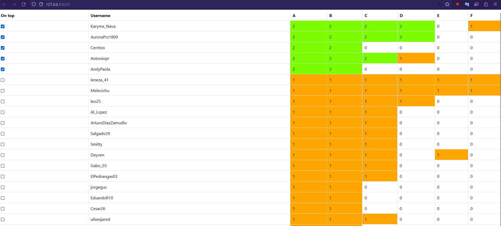

# Description

This application is designed to help organizers and participants of a programming contest monitor the submission and balloon status of the participants, providing real-time updates and detailed information on each submission.

The application periodically fetches new submissions at the start and every 30 seconds, and updates the data accordingly.

Each participant's submission status is marked with a number that indicates whether the problem is 
- 0 -> Unsolved
- 1 -> Solved but balloon not given
- 2 -> Solved and balloon given.

# Usage

1) In the config.py file, at the top set the platform to use (either omegaup or codeforces)
2) In that same file set the appropiated variables for the selected platform in the config file 
3) In your existing python installation or in a virtual environment install the requirements
```
pip install -r requirements.txt
```
4) Run the app
```
python run.py
```

# Note
Once the server is started, by going to the root you're greeted with a table that allows you to check the teams that you want to track and shows the status of the problems for each team as stated before.

This table reloads the data automatically every 10 seconds

To mark a balloon as delivered you just click in the orange tile that you want to mark as delivered and confirm in the popup that opens.

Although if the page is reloaded, you'll have to check again the teams that you want to track 


